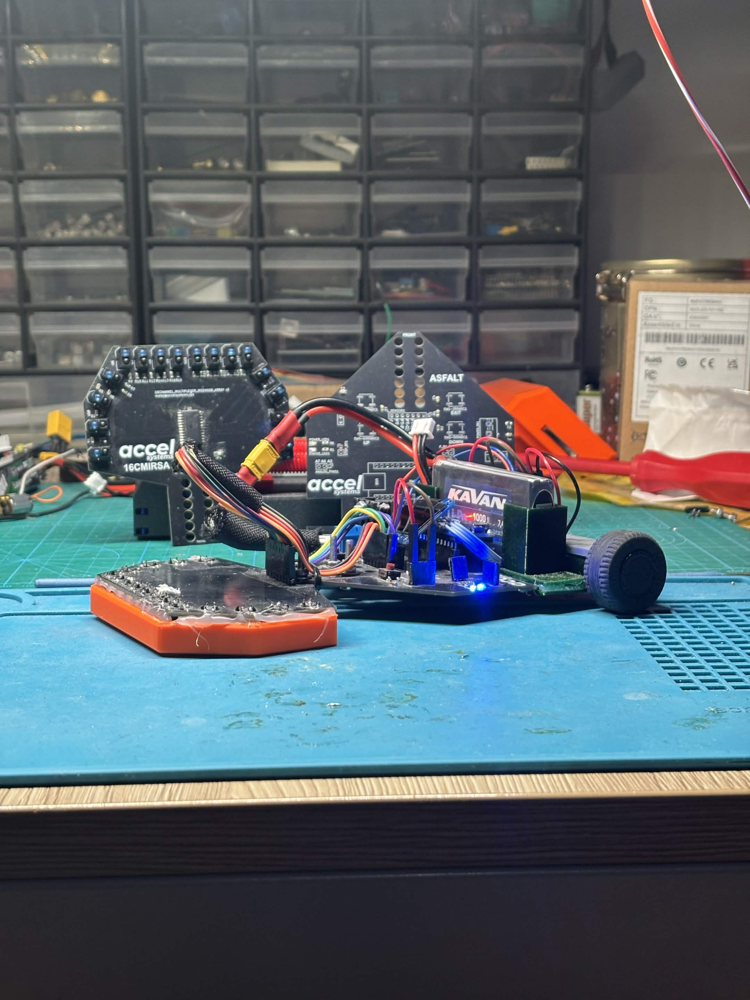

# ASFALT
**Accel Systems Line Following Robot**

A high-resolution line follower built on an Arduino Nano (ATmega328P), featuring a 16-sensor U-shaped IR array, custom KiCad PCBs, 3D-printed chassis parts, and a PID/proportional control algorithm with priority-based corner handling.

## License

This project is open source. Hardware designs, firmware, and mechanical files are provided as-is for personal and educational use.

---

*ASFALT — Accel Systems Line Following Robot*
*ASFALT-REV2 > Updated version single PCB, This repo has support till 1/10/2026